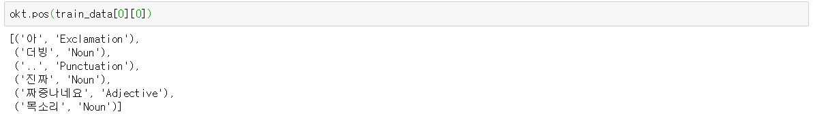
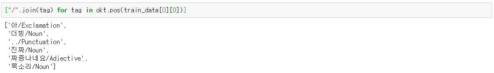
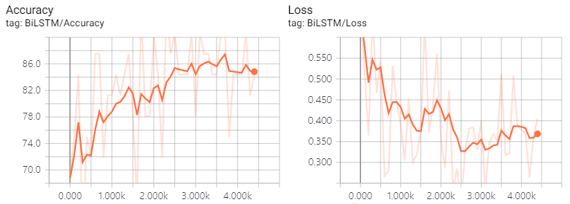
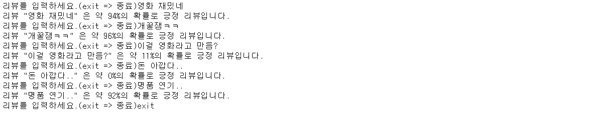

# Sentiment-Classification

## Bidirectional LSTM을 사용한 네이버 영화 리뷰 데이터 분류

### 1. 네이버 영화 리뷰 데이터

네이버에서 제공하는 영화 리뷰 데이터를 사용

학습 데이터 15만건과 테스트 데이터 5만건을 사용

데이터는 리뷰의 id, 리뷰 내용, 리뷰의 label(0: 부정, 1: 긍정)로 구성됨

[데이터 제공](https://github.com/e9t/nsmc)

### 2. Konlpy의 Okt를 사용해 문장 품사 태깅

Konlpy.Okt의 pos 함수를 사용해 문장들을 품사 태깅함

문장들을 토큰화시킴 (단어/품사)

### 3. Gensim의 Word2Vec을 사용해 단어 임베딩

모든 학습 데이터 문장들을 토큰화하고 gensim의 word2vec을 사용해 사전을 만든 후에 학습 시킴

### 4. Tensorflow로 Bidirectional LSTM을 만들어 문장 이진 분류(0 or 1)

5만건의 테스트 데이터에 대해서는 약 83%의 정확도를 기록함

